# MAHINDRA OPSENTINEL AI
### *"Predict disruption. Protect production."*

[](https://vercel.com)
[](https://github.com)
[](LICENSE)

> [!NOTE]
> **Conceptual Prototype Notice:**  
> This system is an Agentic AI-powered Operations Control Tower conceptual prototype modeled on the scale and operational complexity of a large Indian automotive and farm equipment manufacturer (inspired by Mahindra & Mahindra). It operates strictly on a calibrated synthetic operational dataset and does not claim access to proprietary or confidential internal enterprise data.

---

## 1. Executive Summary

Manufacturing organizations frequently experience severe production delays because operational failures are discovered too late. **Mahindra Opsentinel AI** transitions enterprise operations from reactive firefighting to proactive, automated pre-emption across the full decision continuum:

```mermaid
flowchart LR
    Detect[1. DETECT] --> Understand[2. UNDERSTAND]
    Understand --> Predict[3. PREDICT]
    Predict --> Trace[4. TRACE]
    Trace --> Simulate[5. SIMULATE]
    Simulate --> Recommend[6. RECOMMEND]
    Recommend --> Approve[7. APPROVE]
    Approve --> Act[8. ACT]
    Act --> Measure[9. MEASURE]
    Measure --> Learn[10. LEARN]
```



### Core Business Question Answered:
> *"What is likely to go wrong next, why will it happen, what will it impact, and what should we do about it?"*

---

## 2. Key Modules & Capabilities

The system includes 14 fully integrated operational modules:

1. **Operations Overview**: Executive KPI cards, 5 Operational Health Pillars, AI Early Warning Center, live operational change feed, and multi-agent decision trace.
2. **Risk Control Tower**: Interactive 2D Risk Matrix correlating Probability ($X$-axis) and Business Impact ($Y$-axis) with interactive scatter plots and ranked vulnerability registers.
3. **Supplier Intelligence**: Tier-1 vendor reliability directory, OTIF tracking, lead-time variance, and **Single Supplier Dependency & Concentration Analysis** (e.g. C204 Engine ECU 72% concentration on S102).
4. **Inventory Intelligence**: Visual Days of Supply (DOS) vs Target Safety Stock buffer deficit bars, stockout probability forecasts, and component store health.
5. **Production Intelligence**: Plant facilities (Nashik P02, Chakan P01, Zaheerabad P03, Haridwar P04), line capacity utilization, OEE, downtime, schedule adherence, and **starving-line bottleneck alerts**.
6. **Logistics & Shipments**: Active in-transit consignment tracking, route risk evaluation, and carrier ETA delay probabilities (SH-2048 spotlight).
7. **Customer Orders & Delivery**: Order SLA fulfillment monitor across vehicle programs (Scorpio-N, XUV700, Thar, Bolero Neo, Farm Tractors) and delayed batch priority queuing.
8. **Supply Chain Risk Network**: Interactive SVG Digital Twin topology tracing: `Supplier → Component → Plant → Assembly Line → Warehouse → Carrier → Customer Order`.
9. **Risk Propagation Engine**: 4-stage visual physics engine explaining how a 2.8-day ECU delivery delay amplifies into an 8.4% factory output crash and 2,840 delayed customer deliveries.
10. **Scenario Simulator (Digital Twin)**: Interactive "What-If?" stress-test engine with presets (Supplier Outage, Monsoon Road Delay, Demand Surge, Plant Power Cut) and real-time recalculations.
11. **AI Recommendations & Strategy Matrix**: Multi-attribute trade-off comparison: *Do Nothing vs Alternate Supplier S108 vs Air Expedite vs Safety Buffer Surge vs Throttle Lower Lines*.
12. **Ops Copilot**: Conversational AI reasoning assistant enforcing structured outputs (**FACT, PREDICTION, ASSUMPTION, RECOMMENDATION**), confidence scores, and toggleable simplified English mode.
13. **Action Center (Human-in-the-Loop)**: High-impact decision governance queue (*Pending Approval, Approved, In Progress, Completed, Rejected*) requiring executive signoff.
14. **Analytics & Feedback Loop**: Model precision/recall scorecard, Predicted vs Actual Disruption validation log, and closed-loop calibration.
15. **Governance Audit Trail**: Immutable compliance register of all AI advice, manager approvals, overrides, and final business outcomes.

---

## 3. The Core "Explain Why?" Architecture

Every critical metric, risk score, table row, chart, and concept features an active **[Explain Why]** button triggering the contextual drawer. It breaks down data into 4 distinct evidentiary categories:

- **FACT**: Ground-truth telemetry (e.g. *"Component C204 coverage is 6.2 days; Supplier S102 lead time is 14.8 days"*).
- **PREDICTION**: Probabilistic forecast (e.g. *"Stockout probability is 81%; Plant 02 output will drop by 8.4% in 5–7 days"*).
- **ASSUMPTION**: Operational conditions assumed by the model (e.g. *"Festive demand forecast remains at +11%"*).
- **RECOMMENDATION**: Concrete operational decision (e.g. *"Shift 30% procurement volume to qualified secondary Supplier S108"*).

---

## 4. 11-Step Guided Executive Demo Tour

A presentation-ready interactive tour is built directly into the bottom sidebar:
1. **Anomaly Detected**: AI detects lead-time variance (+23%) and OTIF drop (72%) at Supplier S102.
2. **Supplier Risk Surge**: S102 flagged at 82/100 risk.
3. **Component Depletion**: Component C204 buffer drops to 6.2 days (Safety Target: 10d).
4. **Plant Bottleneck**: Nashik Plant 02 Line 2 utilization reaches 94% with zero headroom.
5. **Customer Orders at Risk**: 2,840 vehicle deliveries facing SLA slip.
6. **Disruption Predicted**: Production disruption predicted in 5–7 days (87% probability, ₹1.8 Cr revenue exposure).
7. **Explain Why**: User inspects multi-factor telemetry evidence.
8. **Risk Propagation**: Visualizes cascade from Pune vendor to dealership delivery.
9. **Scenario Simulator**: Tests "What-If S102 stops for 14 days?".
10. **Human Approval**: Operations Director reviews and approves Action ACT-501 in the Action Center.
11. **Outcome Verified**: Disruption avoided, protecting ₹1.65 Cr revenue and 2,660 vehicle deliveries.

---

## 5. Local Development

Run with any local web server:

```bash
# Using Python
python -m http.server 3000

# Or using Node
npx serve .
```

Open `http://localhost:3000` in your web browser.

---

## 6. License

MIT License. Designed for conceptual enterprise portfolio and operational analytics demonstration.
